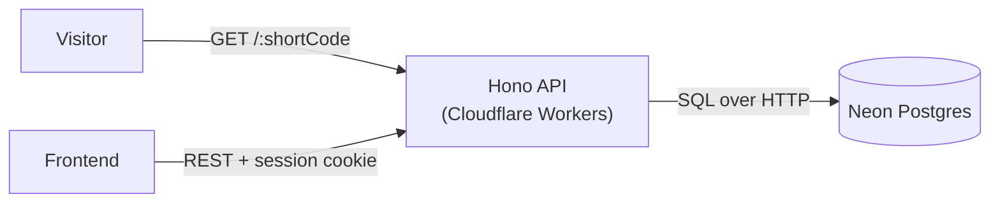
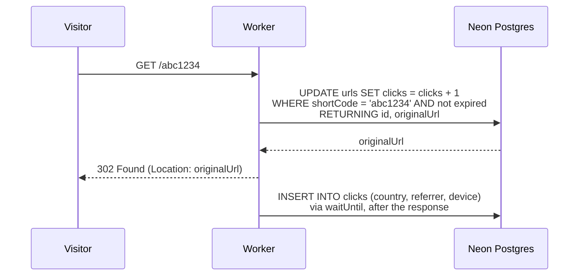

# URL Shortener API

A URL shortener backend running at the edge on Cloudflare Workers: short links, custom aliases, link expiration, user accounts and click analytics, all documented with an interactive OpenAPI reference.

- **Live API:** `https://url-shortener-api.<your-subdomain>.workers.dev`
- **Interactive docs:** `https://url-shortener-api.<your-subdomain>.workers.dev/scalar`
- **Frontend:** coming soon

## Features

- **Short links**: random 7-character codes, or a custom alias like `/my-portfolio` for signed-in users.
- **Fast redirects**: the lookup, expiration check and click counter run in a single `UPDATE ... RETURNING` query. Analytics are written after the response is sent.
- **Click analytics**: clicks per day, top countries, top referrers and device breakdown. No IP address or full user agent is stored.
- **Link expiration**: expired links answer `410 Gone`.
- **Accounts**: email and password authentication. Each user only sees and manages their own links, while anonymous visitors can still create links.
- **OpenAPI 3 spec**: generated from the same Zod schemas that validate requests, browsable with Scalar.

## Tech stack

- **Runtime**: [Cloudflare Workers](https://workers.cloudflare.com/)
- **Framework**: [Hono](https://hono.dev/) with [`@hono/zod-openapi`](https://github.com/honojs/middleware/tree/main/packages/zod-openapi)
- **Database**: [Neon](https://neon.tech/) serverless Postgres, through the HTTP driver
- **ORM**: [Drizzle](https://orm.drizzle.team/) and `drizzle-zod`
- **Auth**: [Better Auth](https://www.better-auth.com/)
- **Validation**: [Zod](https://zod.dev/)
- **Docs**: [Scalar](https://scalar.com/)
- **Tooling**: TypeScript, Biome, Wrangler, pnpm

## Architecture



### Redirect flow



## Technical choices

- **Cloudflare Workers.** Requests are served close to the visitor with no cold start, which matters for a redirect service. Each request also comes with geolocation data (`request.cf.country`), so country analytics need no third-party service.
- **Neon over HTTP.** Workers cannot keep a pool of TCP connections between requests, so each query is a single HTTP call. The stats endpoint uses `db.batch` to send its four aggregation queries in one round trip.
- **One source of truth for types.** Drizzle tables generate Zod schemas (`drizzle-zod`), and those schemas validate requests, type the handlers and generate the OpenAPI document.
- **Typed authentication.** On protected routes, the auth middleware puts the user on the context with a non-null type, so handlers never check for a missing user.
- **`waitUntil` for analytics.** The visitor is redirected immediately, and recording the click finishes in the background. A failure is logged and never breaks the redirect.
- **`302` instead of `301`.** Browsers cache permanent redirects, so later clicks would never reach the API and analytics would be lost.

## API overview

The full, always up-to-date reference lives at `/scalar`.

| Method   | Path                        | Auth     | Description                                       |
| -------- | --------------------------- | -------- | ------------------------------------------------- |
| `GET`    | `/{shortCode}`              | None     | Redirect to the original URL                      |
| `POST`   | `/urls`                     | Optional | Create a short link (custom alias requires auth)  |
| `GET`    | `/urls`                     | Required | List your links (paginated)                       |
| `GET`    | `/urls/{shortCode}`         | Required | Get one of your links                             |
| `PATCH`  | `/urls/{shortCode}`         | Required | Update the target URL or expiration date          |
| `DELETE` | `/urls/{shortCode}`         | Required | Delete a link and its analytics                   |
| `GET`    | `/urls/{shortCode}/stats`   | Required | Click analytics over the last `?days=` days       |
| `GET` `POST` | `/api/auth/*`           | n/a      | Better Auth endpoints (sign up, sign in, session) |

## Project structure

```text
src/
├── app.ts              # Entry point: mounts the modules
├── env.ts              # Environment validation
├── db/
│   ├── schemas/        # Drizzle tables: auth, urls, clicks
│   └── migrations/     # SQL migrations generated by drizzle-kit
├── lib/                # App factory, auth config, OpenAPI setup, shared types
├── middlewares/        # Auth middlewares and protected/optional route helpers
├── modules/            # One folder per feature: routes, handlers, router
│   ├── urls/
│   └── redirect/
└── services/           # Business logic: short codes, click tracking, stats
```

## Getting started

**Prerequisites:** Node.js 20+, pnpm, and a [Neon](https://neon.tech/) database (the free tier is enough).

```bash
pnpm install
cp .env-example .env        # then fill in the values
pnpm drizzle-kit migrate    # create the tables
pnpm dev
```

The API runs on `http://localhost:8787`, and the docs are at `http://localhost:8787/scalar`.

### Environment variables

| Variable             | Description                                                              |
| -------------------- | ------------------------------------------------------------------------ |
| `DATABASE_URL`       | Neon connection string                                                   |
| `BETTER_AUTH_URL`    | Public URL of the API                                                    |
| `BETTER_AUTH_SECRET` | Random secret used to sign sessions (`openssl rand -base64 32`)          |
| `TRUSTED_ORIGINS`    | Comma-separated frontend origins allowed to call the API with cookies    |
| `LOG_LEVEL`          | `fatal`, `error`, `warn`, `info`, `debug` or `trace` (default: `info`)   |

## Deployment

```bash
npx wrangler secret put DATABASE_URL
npx wrangler secret put BETTER_AUTH_SECRET
npx wrangler secret put BETTER_AUTH_URL
npx wrangler secret put TRUSTED_ORIGINS
pnpm drizzle-kit migrate
pnpm run deploy
```

## Known limitations

- **Cross-site cookies.** While the frontend and the API live on different `workers.dev` subdomains, the session cookie is sent cross-site (`SameSite=None; Partitioned`). Browsers that block third-party cookies, such as Safari, may refuse it. Serving both apps from subdomains of the same custom domain, with Better Auth's `crossSubDomainCookies`, removes this limitation.
- **Bot traffic.** Link previews from Slack, Discord or WhatsApp count as clicks. They are tagged with the `bot` device so the frontend can filter them out.
